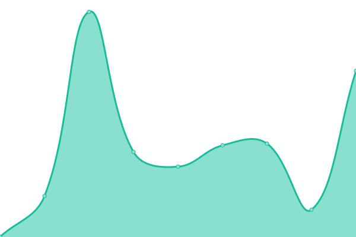

# [📈 Live Status](https://fastandcomfy.github.io/bug-free-train): <!--live status--> **🟩 All systems operational**

This repository contains the open-source uptime monitor and status page for [Fast and Comfy Technologies](https://fastandcomfy.io), powered by [Upptime](https://github.com/upptime/upptime).

With [Upptime](https://upptime.js.org), you can get your own unlimited and free uptime monitor and status page, powered entirely by a GitHub repository. We use [Issues](https://github.com/fastandcomfy/bug-free-train/issues) as incident reports, [Actions](https://github.com/fastandcomfy/bug-free-train/actions) as uptime monitors, and [Pages](https://fastandcomfy.github.io/bug-free-train) for the status page.

<!--start: status pages-->
<!-- This summary is generated by Upptime (https://github.com/upptime/upptime) -->
<!-- Do not edit this manually, your changes will be overwritten -->
<!-- prettier-ignore -->
| URL | Status | History | Response Time | Uptime |
| --- | ------ | ------- | ------------- | ------ |
|  [DEV API](https://apidev.fastandcomfy.io) | 🟩 Up | [dev-api.yml](https://github.com/fastandcomfy/bug-free-train/commits/HEAD/history/dev-api.yml) | 

 1096ms
     
 | 

<a href="https://status.fastandcomfy.io/history/dev-api">100.00%</a>
    

|  [DEV Developers](https://developersdev.fastandcomfy.io) | 🟩 Up | [dev-developers.yml](https://github.com/fastandcomfy/bug-free-train/commits/HEAD/history/dev-developers.yml) | 

 527ms
     
 | 

<a href="https://status.fastandcomfy.io/history/dev-developers">100.00%</a>
    

|  [DEV Web](https://dev.fastandcomfy.io) | 🟩 Up | [dev-web.yml](https://github.com/fastandcomfy/bug-free-train/commits/HEAD/history/dev-web.yml) | 

 363ms
     
 | 

<a href="https://status.fastandcomfy.io/history/dev-web">99.90%</a>
    

|  [DEV Wizard](https://wizarddev.fastandcomfy.io) | 🟩 Up | [dev-wizard.yml](https://github.com/fastandcomfy/bug-free-train/commits/HEAD/history/dev-wizard.yml) | 

 314ms
     
 | 

<a href="https://status.fastandcomfy.io/history/dev-wizard">99.95%</a>
    

|  DEV Wizard BE | 🟩 Up | [dev-wizard-be.yml](https://github.com/fastandcomfy/bug-free-train/commits/HEAD/history/dev-wizard-be.yml) | 

 924ms
     
 | 

<a href="https://status.fastandcomfy.io/history/dev-wizard-be">100.00%</a>
    

|  DEV API BE | 🟩 Up | [dev-api-be.yml](https://github.com/fastandcomfy/bug-free-train/commits/HEAD/history/dev-api-be.yml) | 

 544ms
     
 | 

<a href="https://status.fastandcomfy.io/history/dev-api-be">100.00%</a>
    

|  DEV W1 BE | 🟩 Up | [dev-w1-be.yml](https://github.com/fastandcomfy/bug-free-train/commits/HEAD/history/dev-w1-be.yml) | 

 801ms
     
 | 

<a href="https://status.fastandcomfy.io/history/dev-w1-be">100.00%</a>
    

|  DEV E1 BE | 🟩 Up | [dev-e1-be.yml](https://github.com/fastandcomfy/bug-free-train/commits/HEAD/history/dev-e1-be.yml) | 

 767ms
     
 | 

<a href="https://status.fastandcomfy.io/history/dev-e1-be">100.00%</a>
    

|  BE Server | 🟩 Up | [be-server.yml](https://github.com/fastandcomfy/bug-free-train/commits/HEAD/history/be-server.yml) | 

 133ms
     
 | 

<a href="https://status.fastandcomfy.io/history/be-server">100.00%</a>
    

<!--end: status pages-->

[**Visit our status website →**](https://fastandcomfy.github.io/bug-free-train)

## 📄 License

- Powered by: [Upptime](https://github.com/upptime/upptime)
- Code: [MIT](./LICENSE) © [Fast and Comfy Technologies](https://fastandcomfy.io)
- Data in the `./history` directory: [Open Database License](https://opendatacommons.org/licenses/odbl/1-0/)
